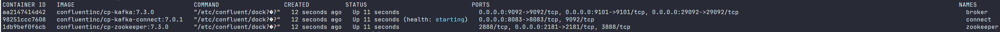
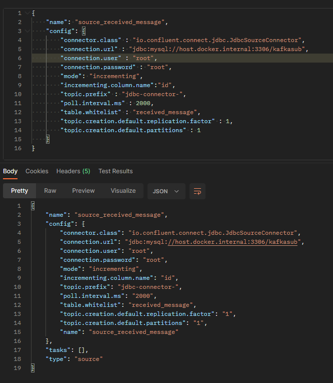
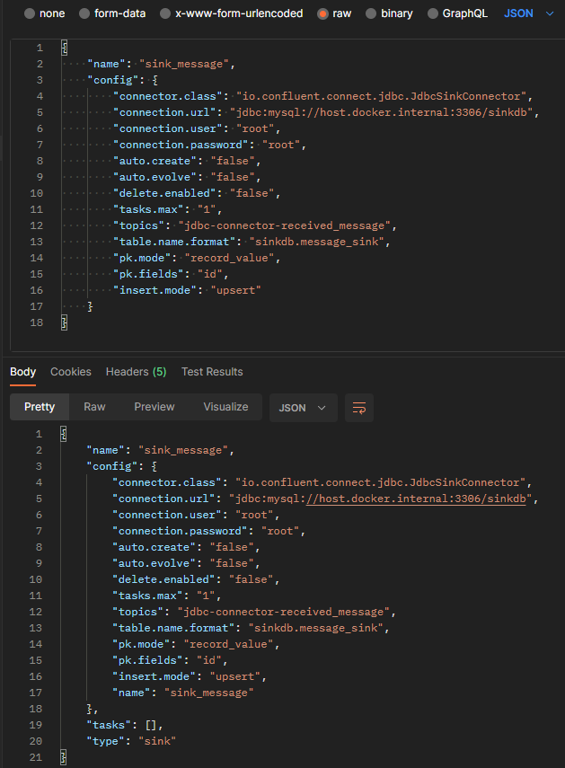

# Getting Started

## 1. Start kafka cluster with docker compose

```shell
# cd 경로/kafka_app/docker
docker-compose up -d
```


## 2. Create mysql database
```sql

-- DB생성
CREATE DATABASE kafkasub DEFAULT CHARACTER SET utf8 COLLATE utf8_general_ci;
CREATE DATABASE sinkdb DEFAULT CHARACTER SET utf8 COLLATE utf8_general_ci;

-- 테이블생성
CREATE TABLE kafkasub.received_message
(
    id            int not null auto_increment,
    topic_name    VARCHAR(100),
    payload       json,
    creation_time DATETIME DEFAULT CURRENT_TIMESTAMP,
    PRIMARY KEY (id)
);
       
CREATE TABLE sinkdb.message_sink
(
    id            int not null auto_increment,
    topic_name    VARCHAR(100),
    payload       json,
    creation_time DATETIME DEFAULT CURRENT_TIMESTAMP,
    PRIMARY KEY (id)
);

-- 테이블확인
select * from kafkasub.received_message;
select * from sinkdb.message_sink;
```

## 3. Create Test topic
```shell
docker exec -it broker /bin/bash

# test-event 토픽 생성
/usr/bin/kafka-topics --create --topic test-event --bootstrap-server localhost:9092

# 생성토픽 확인
/usr/bin/kafka-topics --bootstrap-server localhost:9092 --list
```

## 3. Start kafka app
kafka_app/src/main/java/com/kafka/example.kafka_app/KafkaAppApplication.java 실행

## 4. Create kafka connector

### 4. 1. DB source connector 생성
- kafka_app/http/connector/kafka_connector_source.http


### 4. 2. DB sink connector 생성
- kafka_app/http/connector/kafka_connector_sink.http


## 5. Publish message to test-event topic
kafka_app/http/KafkaProductAPI.http

## 6. Check message data & sink data
```sql
-- kafka 메시지 저장 확인
select * from kafkasub.received_message;

-- kafka data sink 확인
select * from sinkdb.message_sink;
```